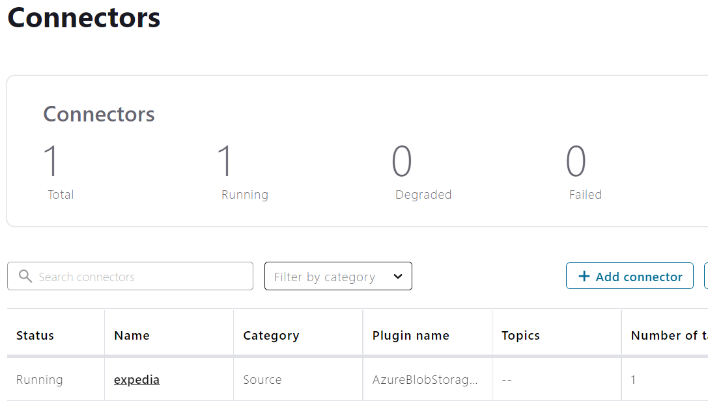
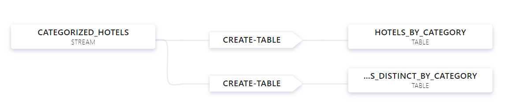
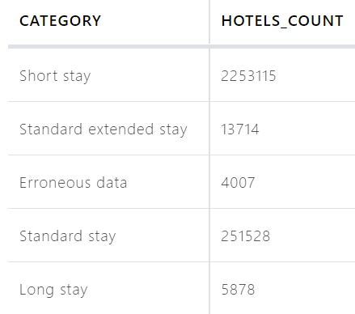
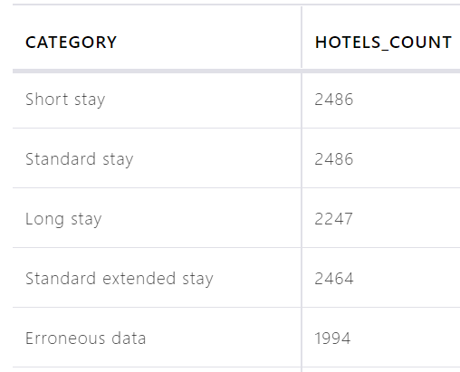

* Modify main.tf
    ```
      terraform {
      backend "azurerm" {
        subscription_id = <your_subscription_id>
        resource_group_name = <your_resource_group_name>
        storage_account_name = <your_storage_account_name>
        container_name = <your_container_name>
        key = <your_key>
      }
    }
    ```
* Deploy infrastructure with terraform
    ```
    terraform init
    terraform plan -out terraform.plan
    terraform apply terraform.plan
    ```

* Build new Azure Container Registry

* Build docker image for connector (connectors/Dockerfile)
    ```
    docker build -t <yourconnectordocker>
    ```

* Login to Azure Container Registry
    ```
    az acr login -n <ACR_NAME>
    ```

* Push docker images to Azure Container Registry
    ```
    docker tag <your(consumer/connector)docker> <ACR_NAME>.azurecr.io/<your(consumer/connector)docker>
    docker push <ACR_NAME>.azurecr.io/<your(consumer/connector)docker>
    ```

* Connect to AKS
    ```
    az account set --subscription <$SUBSCRIPTION_ID>
    az aks get-credentials --resource-group <RESOURCE_GROUP> --name <NAME_OF_AKS>
    ```

* Attach ACR to AKS
    ```
    az aks update -n kubernetes-service-name -g <RESOURCE_GROUP> --attach-acr <ACR_NAME>
    ```

* Install the KSQL DB to the cluster.
  ```
  kubectl apply -f ksqldb.yaml
  ```

* Deploy all the components mentioned above to the cluster
  ```
  kubectl apply -f confluent-platform.yaml
  ```

* Wait before the connect component will be ready to register the connector

* Create producer
  ```
  kubectl apply -f producer-app-data.yaml
  ```

* Upload expedia topic configuration
  ```
  CONNECT_HOST_NAME=$(kubectl get service connect-external -o jsonpath="{.status.loadBalancer.ingress[0].ip}")
  curl -s -X POST -H 'Content-Type: application/json' --data @connectors/azure_source_cc_expedia.json "$CONNECT_HOST_NAME:8083/connectors"
  ```


* After we deploy the confluent components we need to create the source connector:

  

  
* When we have enriched data we can start analyzing it with the KSQL DB.
  ```
  SET 'auto.offset.reset' = 'earliest';
  SET 'cache.max.bytes.buffering' = '0';
  
  CREATE
  STREAM CATEGORIZED_HOTELS
  WITH (kafka_topic='expedia-ext', value_format='AVRO');
  
  // total amount of hotels (hotel_id) for each category
  
  CREATE TABLE HOTELS_BY_CATEGORY WITH (PARTITIONS = 1) AS
  SELECT CATEGORY, COUNT(HOTEL_ID) AS HOTELS_COUNT
  FROM CATEGORIZED_HOTELS
  GROUP BY CATEGORY EMIT CHANGES;
  
  // number of distinct hotels (hotel_id) for each category
  
  CREATE TABLE HOTELS_DISTINCT_BY_CATEGORY WITH (PARTITIONS = 1) AS
  SELECT CATEGORY, COUNT_DISTINCT(HOTEL_ID) AS HOTELS_COUNT
  FROM CATEGORIZED_HOTELS
  GROUP BY CATEGORY EMIT CHANGES;
  ```
  

* Total amount of hotels (hotel_id) for each category

  


* Number of distinct hotels (hotel_id) for each category

  
